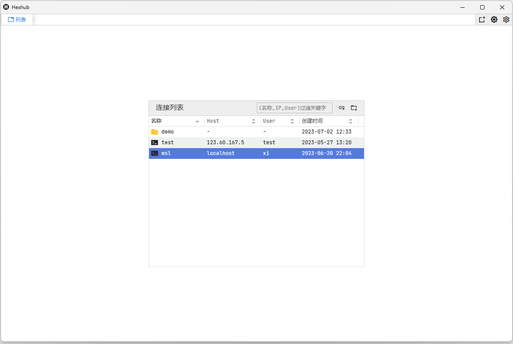
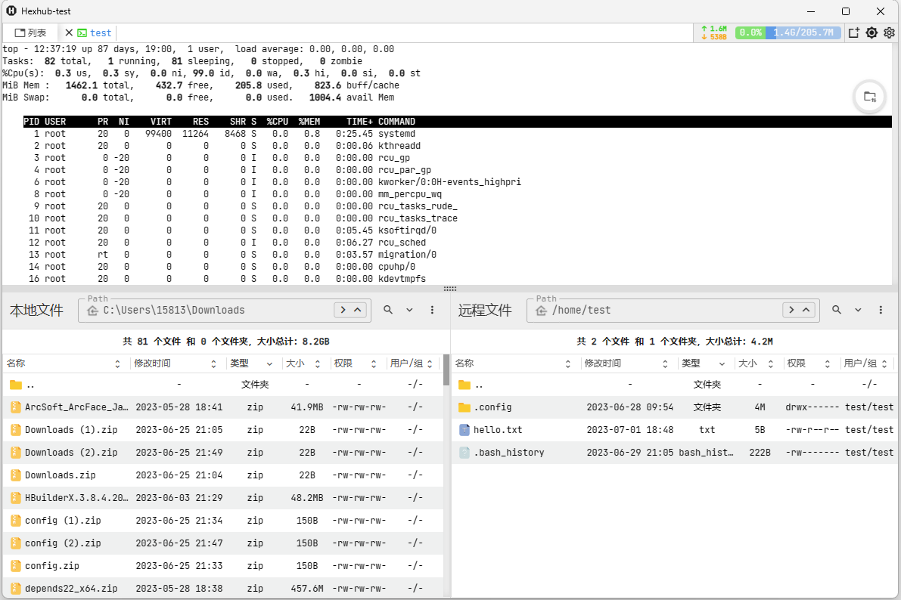
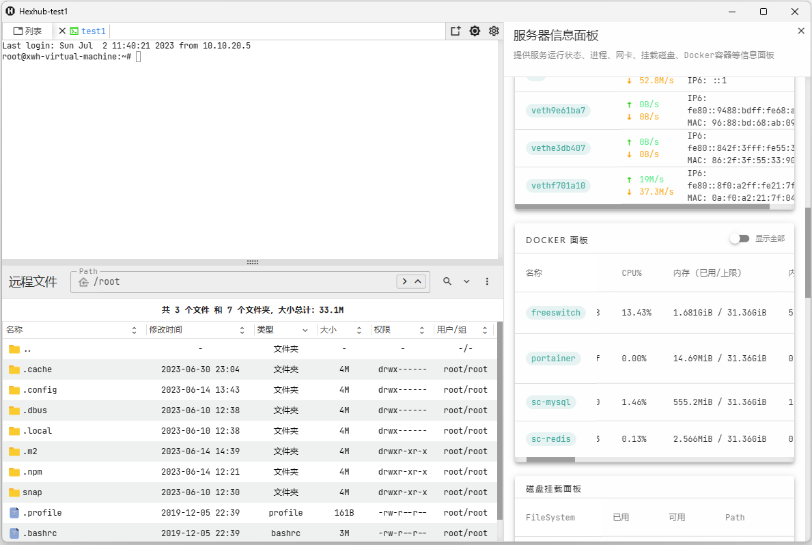
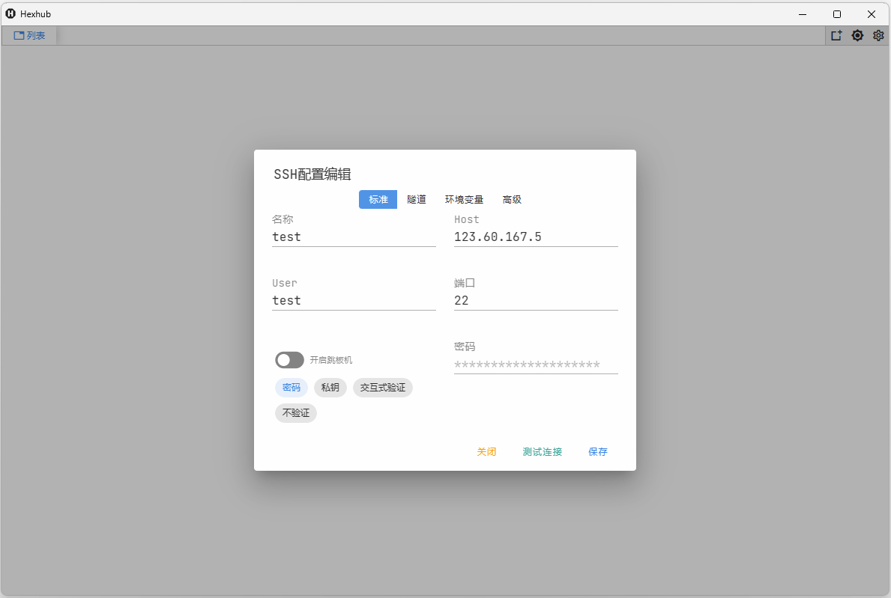

# Hexhub

## 介绍

Hexhub 是一款开源的SSH、SFTP、数据库管理客户端，，数据库管理模块目前还在开发之中。

## 运行截图

### SSH客户端功能
-[X] SSH终端
-[X] SFTP文件管理/编辑
-[X] SFTP多文件上传/下载
-[X] SCP多文件上传/下载
-[X] 本地文件管理
-[X] TCP/Socks5 SSH隧道
-[X] ZMODEM(SZ/RZ)
-[X] 跳板机登录
-[X] 快捷指令
-[X] 批量执行命令
-[X] 服务器监听面板
-[X] Docker管理面板
-[X] 配置导入/导出
-[X] 分类目录&资产管理
-[X] 终端多标签显示
-[X] 暗色/亮色双主题

### MySQL客户端(开发中)
-[X] 表/视图列表管理
-[X] SQL编辑器
-[X] 表数据编辑/展示
-[ ] 表结构编辑器
-[ ] 数据导入导出
-[ ] 数据字典导出
-[ ] 表结构同步
-[ ] 数据库模糊查找
-[ ] DDL版本管理
-[ ] 资产管理

### Redis客户端(规划中)

### Postgresql客户端(规划中)

### MongoDB客户端(规划中)

## 访问地址

https://hexhub.cn/

## 联系方式

如果您有更好的建议或者问题反馈，请发送邮件至 xiweihai@gmail.com 联系我。

## License

本项目使用 [LGPL-3](./LICENSE) 协议，请自觉遵守。
